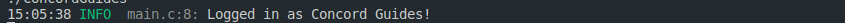

# Getting the bot started

## config.json directives

The `config.json` file is a configuration file that can be used to start your bots from. Since it's read at runtime, it is especially useful if you want to avoid having to recompile your bot application for each small configuration that gets added. This guide outlines some of the configuration options you can modify, and also how to add your own.

```json
{
  "token": "YOUR-BOT-TOKEN",
  "log": {
    "level": "TRACE",
    "trace": "bot.log",
    "quiet": false,
    "overwrite": true,
    "color": true,
    "http": "http.log",
    "ws": "ws.log",
    "disable": ["WEBSOCKETS", "HTTP"]
  }
}
```

### token

The token that Concord will use to log in to the bot, in case you use the `discord_config_init` to define the `struct discord *client`.

### log

#### level

logging.level defines the type of log that will be used to log if you set quiet to false.

Available levels are: "TRACE", "DEBUG", "INFO", "WARN", "ERROR", "FATAL"

Screenshot of logging.level set as "debug"


#### trace

This sets the file name of the file that you wish your log is saved into it.

#### quiet

That configuration disables the default concord logging.

Screenshot as example:

True:


False (You can see the Concord's default logging messages disappear):



#### overwrite

In case to avoid your logging files getting too big, you can set this to true so that whenever the bot logs in, Concord will empty the logging files.
  
#### color

This adds colors to Concord's logging messages, so it will look better and you can see WARNS/ERRORS with ease.

Screenshots of logging.color set as true and set as false.

True:


False:


#### http

The filename of the file that will be used to save the information of the HTTP(s) requests. Set to null to disable.

#### ws

The filename of the file that will be used to save WebSockets information. Set to null to disable.

#### disable

Disables one or more of Concord's default logging modules instead of disabling all of them like log.quiet.
Available modules to disable include "WEBSOCKETS" and "HTTP".

Screenshots of disabling "WEBSOCKETS" and also not disabling any logging:

Disabling "WEBSOCKETS":


Not disabling any:


## Custom Fields

You can also put custom fields on your config.json and get its value with the `discord_config_get_field` function. See the following example.

```c
char foo[16];

struct ccord_szbuf_readonly value = discord_config_get_field(client, (char *[2]){ "field", "foo" }, 2);

snprintf(foo, sizeof(foo), "%.*s", (int)value.size, value.start);
```

```c
struct ccord_szbuf_readonly discord_config_get_field(struct discord *client, char *const path[], unsigned depth)
```

Attention: this function will only work if you initialize your bot with the `discord_config_init`.

The first argument of `discord_config_get_field` is the `struct discord *client` that `discord_init`/`discord_config_init` (or also, in case the code is inside some kind of event, it might be on the event parameters) returns to you.

The second argument is a `const x[]` (also known as `array`) the path to the field where you want to get its value.

The third argument is an `int` value of the depth of the path, for example, if the path was `field -> another_field -> foo` it would be 3
